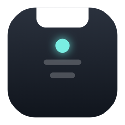
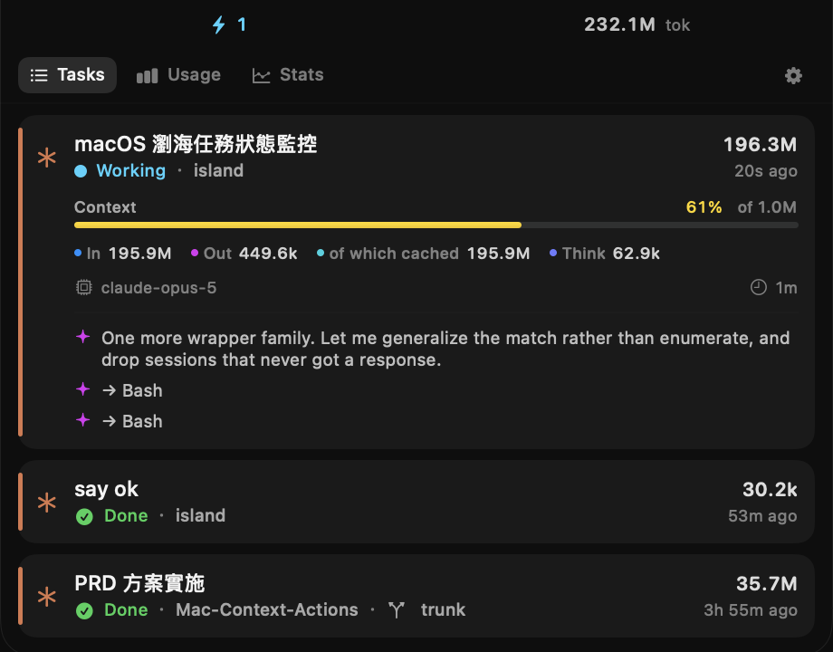
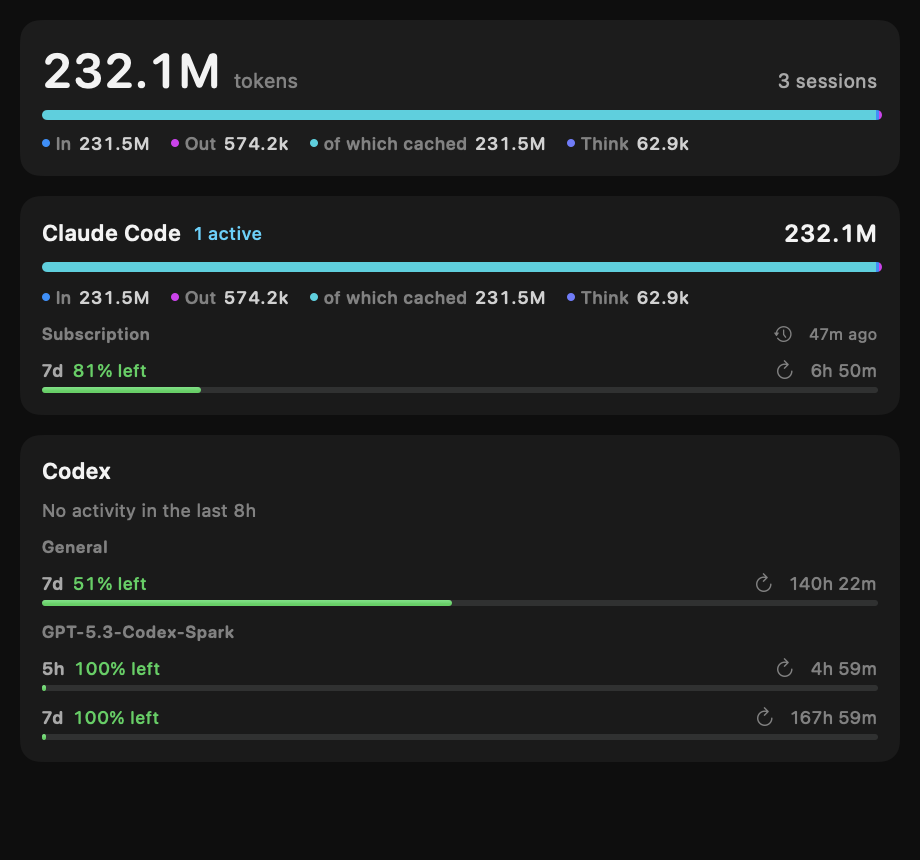
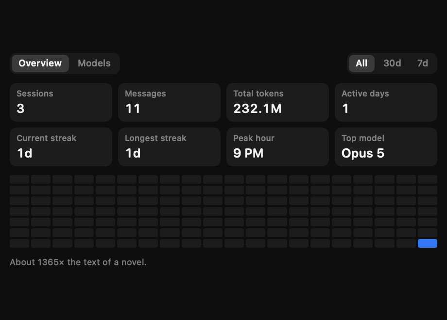
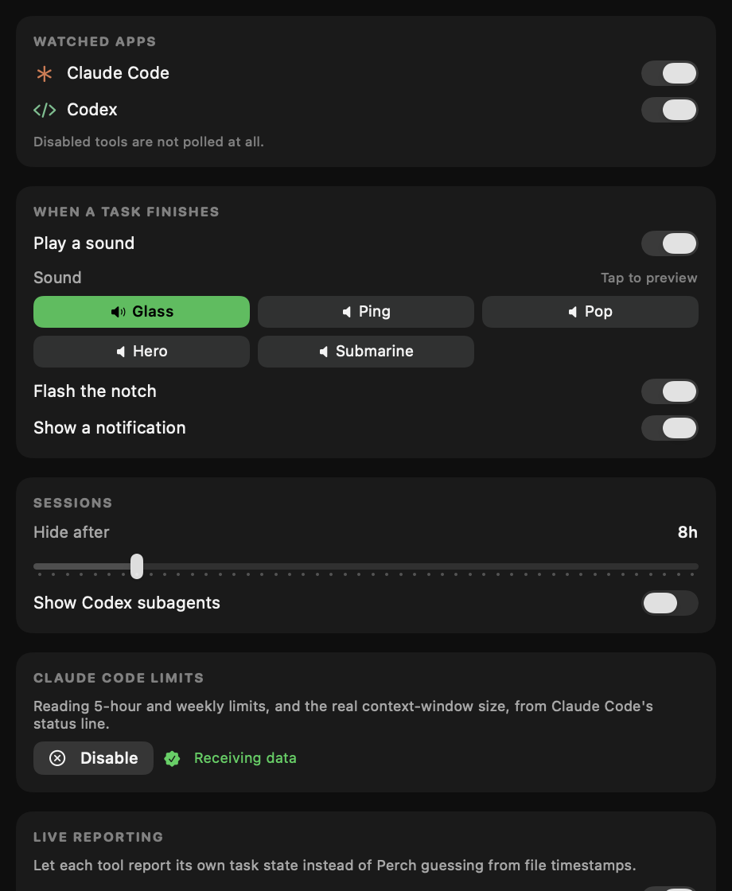

<div align="center">



# Perch

**讓你的 AI 編碼助手，棲息在瀏海上。**

一眼看清 Claude Code 與 Codex：誰在工作、誰在等你，額度還剩多少。

[English](../README.md) · macOS 14+ · MIT


</div>

---

## 它做什麼

兩組小小的指示貼著實體瀏海，中間的凹口保持淨空。左邊是脈動的狀態點與進行中的數量，右邊每個工具一枚帶色徽章——閒置時淡化，有事等你時右上角亮起小黃點。

把游標移上去，面板就落下來。



每個 session 的狀態、專案、分支、context 儀表，以及最近幾輪對話。點一列展開細節，點箭頭直接跳到對應的應用。

觸發區域只有瀏海那一條和兩側的指示——**不是**整個視窗——所以游標經過螢幕中間不會誤觸。

## 用量與額度



每個工具的花費，以及帳號持有的每一個額度桶，都附重置倒數。Codex 會同時提供一般額度與各模型專屬額度，所以每個桶都標了名字：某個模型桶顯示 0%，完全不代表你的一般額度也是 0%。

數字取自工具本身。若某個讀數無法自行刷新，會標上它的年齡，而不是假裝是當下的。

## 統計



Session 數、訊息數、token、活躍天數、連續天數、尖峰時段與最常用模型，可切換全部／30 天／7 天。**Models** 分頁用堆疊柱狀圖把同一區間依模型拆開。

---

## 安裝

```bash
./build-app.sh release
open build/Perch.app
```

Perch 是輔助型應用（accessory app），沒有 Dock 圖示，一切都在選單列項目與瀏海上。想開機自啟，到「系統設定 → 一般 → 登入項目」加入 `build/Perch.app`。

## 主動上報

Perch 可以讀日誌，也可以讓工具**主動告訴它發生了什麼**。後者更準：檔案的修改時間分不出「模型正在思考」和「三十秒前就結束了」，而生命週期事件是在狀態轉換的**當下**觸發，並且直接說明是哪一種轉換。

兩個工具各用自己的機制，因為它們沒有任何共通介面：

| | Claude Code | Codex |
|---|---|---|
| 機制 | [hooks](https://code.claude.com/docs/en/hooks) | `config.toml` 的 `notify` |
| 事件 | SessionStart · UserPromptSubmit · Stop · Notification · SessionEnd | `agent-turn-complete` |
| 寫入 | `~/.claude/settings.json` | `~/.codex/config.toml` |
| 共存方式 | 與你自己的 hooks 並存 | **串接**原本已設定的 `notify` 程式 |

在 **Settings → Live reporting** 開啟。



兩者都是選擇性啟用且可還原：解除安裝會把 `config.toml` 還原到 byte-for-byte 一致，並且只移除 Perch 自己的 hook 項目。

上報結果會寫成小 JSON 檔，放在 `~/Library/Application Support/Perch/Reports/`。用檔案系統當傳輸層是刻意的——hook 是短命行程，不該卡在 socket 握手上；Perch 沒開時事件仍會保留，開晚了也不會漏。Perch 監看這些目錄，所以 hook 一觸發就立即刷新，不必等下一次輪詢。

---

## 數字從哪裡來

| | Claude Code | Codex |
|---|---|---|
| Session | `~/.claude/projects/**/*.jsonl` | `~/.codex/sessions/**/rollout-*.jsonl` |
| 任務狀態 | hooks（推送）→ 推論 | `notify`（推送）→ 生命週期事件 |
| Token | 逐次請求的 `usage`，去重後累加 | `token_count`，本身已是累計值 |
| 額度 | [狀態列](https://code.claude.com/docs/en/statusline) | app-server 協議的 `account/rateLimits/read` |
| Context window | 狀態列（`context_window_size`） | 日誌（`model_context_window`） |

以下幾件事一開始都做錯過，程式碼裡有對應註解：

**Token 只算一次。** 兩家對「快取輸入」的定義不同：Codex 的 `input_tokens` **已經包含**快取（`input + output == total`），而 Anthropic 的 cache read/write 是**與 `input` 並列**的。Perch 把兩者正規化成「快取永遠是 input 的組成部分，而非額外的量」——搞錯這點會讓 Codex 灌水約兩倍。

**回應也只算一次。** Claude Code 每個 content block 寫一筆 `assistant` 記錄，每一筆都重複整個回應的用量。以 `(message.id, requestId)` 去重後，修掉了 1.84 倍的超計。

**用量讀整個日誌，不是尾巴。** 15 MB 的 session 日誌，256 KB 的尾讀只涵蓋約 1.7% 的請求。累計值改用串流全檔掃描，並以 byte offset 建立每檔案的增量帳本，所以兩秒一次的輪詢只解析新追加的位元組。

**隱藏的 session 一樣花錢。** Codex 的 subagent 不佔列表（一個請求可能生十幾個），但它們原本連總量也被丟掉——而在一般的工作日裡，它們佔了花費的絕大部分。現在「顯示哪些列」和「計算哪些帳」是兩件獨立的事。

**額度屬於帳號，不屬於 session**，而且比 session 活得久。Provider 獨立回報額度，所以最近沒跑過的工具依然會顯示它的額度。

**無法自行刷新的讀數要保留，不是丟棄。** Codex 可以即時查詢；Claude Code 的讀數只在 session 繪製狀態列時產生，session 一結束就沒有東西能刷新它。原本丟棄的做法會讓額度在幾分鐘後憑空消失，現在改為保留並標註年齡。在同一個視窗週期內用量只增不減，所以舊的百分比是一個**下限**。真正讓讀數失去意義的是視窗過了 `resets_at`——那種情況無條件丟棄。

**「需要授權」是需要注意，不是任務完成。** Claude Code 的 `Notification` hook 也會在 `idle_prompt`（任務進行中）觸發。全部訂閱會讓完成提示音在任務還沒結束時響起。

---

## 撰寫外掛

外掛就是任何會在 stdout 印出 JSON session 陣列的執行檔，不需要寫 Swift。把一個目錄放進 `~/Library/Application Support/Perch/Plugins/<你的工具>/`：

```json
{
  "id": "my-agent",
  "displayName": "My Agent",
  "symbol": "sparkles",
  "accentHex": "#4285F4",
  "command": "probe",
  "timeout": 5,
  "availabilityPath": "~/.my-agent"
}
```

執行檔輸出：

```json
[{
  "nativeID": "abc123",
  "title": "修正登入問題",
  "state": "running",
  "workingDirectory": "/Users/me/proj",
  "usage": { "input": 1200, "output": 340, "contextWindow": 128000 },
  "target": "bundle:com.example.MyAgent"
}]
```

必填欄位只有 `nativeID`、`title`、`state`。

- **`state`** — `running`、`awaitingInput`、`awaitingApproval`、`completed`、`failed`
- **`target`** — `pid:1234`、`bundle:com.example.App`、`url:https://…`、`file:/path`

完整範例在 [`examples/gemini-plugin/`](../examples/gemini-plugin/)。外掛以你的身分執行、每次輪詢都會跑，所以務必要快——Perch 會強制逾時，卡住、崩潰或輸出亂碼的外掛只會在面板底部顯示錯誤，不影響其他 provider。

偏好 Swift？實作 `PerchKit` 裡的 `AgentProvider` 即可。

## 設計取捨

- **輪詢會自適應**：有任務進行時 2 秒，全部閒置時 10 秒。
- **顯示讀尾巴，總量走串流**：兩種需求，兩種讀法。
- **面板不搶焦點**：`.nonactivatingPanel`，可以成為 key（讓點擊生效）但永不成為 main。
- **Provider 彼此隔離**：並行輪詢，其中一個拋錯或卡住不會拖住其他的。
- **顏色明確指定，不用語意色**：面板恆為暗色，`.secondary` 會對錯背景解析。
- **沒有瀏海也能用**：退回選單列中央的一條區域。

## 測試

```bash
swift test
```

144 個測試。其中最重要的那幾個會**繞過 Perch 自己的解析器**，直接從原始日誌與 Codex 協議重新算出真值，再斷言 Usage 分頁的數字相符——兩個工具、每一個額度桶都驗。這才能防止顯示的用量與現實脫節，而不是只讓 Perch 跟自己比對。

其餘涵蓋狀態推論、token 與 context 的區分、額度解析、統計彙總、完成提示的防抖、設定持久化、觸發區域邊界、面板幾何、外掛行為（含逾時與格式錯誤），以及更名遷移。

## 參考的專案

瀏海幾何與 non-activating panel 的做法參考自 [DynamicNotchKit](https://github.com/MrKai77/DynamicNotchKit)——用 `auxiliaryTopLeftArea` / `auxiliaryTopRightArea` 反推精確邊界，而不是寫死尺寸——以及 [TheBoringNotch](https://github.com/TheBoringTeam/theboringnotch)。

用量這部分受惠於 [ccusage](https://github.com/ccusage/ccusage)（5 小時區塊重建、回應去重鍵）與 [Claude-Code-Usage-Monitor](https://github.com/Maciek-roboblog/Claude-Code-Usage-Monitor)（為每個數字標註來源可信度）。

那些工具呈現的是媒體、檔案與系統 HUD，或者活在終端機裡。Perch 呈現的是 AI 助手的任務狀態，並且圍繞外掛邊界設計，讓任何工具都能出現在上面。

## 授權

MIT
