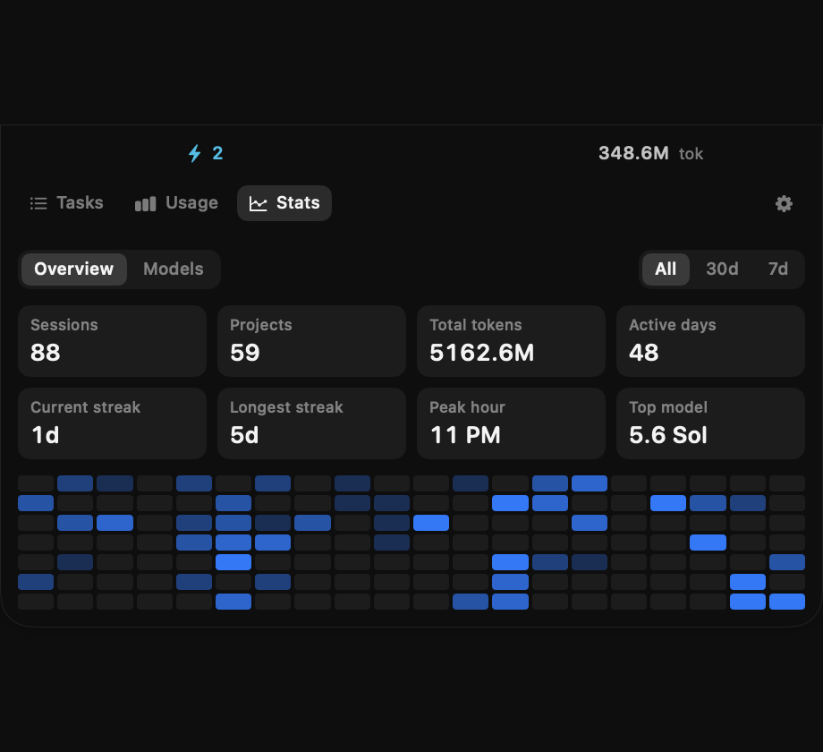

<div align="center">


# Perch

### 讓你的 AI 編碼助手，棲息在瀏海上。

Claude Code 與 Codex，始終在餘光可及之處——
誰在工作、誰在等你、額度還剩多少。

[English](../README.md) · macOS 14+ · MIT


</div>

---

## 安裝

1. [**下載 Perch 0.1.0**](https://github.com/ctudoudou/Perch/releases/latest)，解壓縮。
2. 把 `Perch.app` 拖進 `/Applications`。
3. 開啟**之前**，先執行這一行：

```bash
xattr -cr /Applications/Perch.app
```

然後就跟一般 App 一樣開啟即可。

第 3 步不能省。Perch 未經 Apple 公證，macOS 會把 bundle 裡的**每一個檔案**都標記為隔離，並且告訴你「App 已損毀」、只給「移到垃圾桶」的選項。`xattr -cr` 會清掉整個 bundle——只清最外層的話，裡面的執行檔仍然被標記，App 照樣打不開。

需要 macOS 14 以上。Universal binary，Apple silicon 與 Intel 皆可。

---

## 為什麼做這個

我老是搞丟自己的 agent。

丟一個長任務給 Claude Code，切到別的視窗，然後就忘了。同時 Codex 又在另一個地方跑著。十分鐘後你開始翻視窗，想搞清楚哪個還在思考、哪個其實已經等你很久了、以及自己是不是快撞到額度上限。

瀏海是本來就在視線裡的一塊死空間。Perch 把答案放在那裡。

## 靜止時

兩組小指示貼著瀏海，中間的凹口保持淨空：左邊是脈動的狀態點與進行中的數量，右邊每個工具一枚徽章——閒置時淡化，有事等你時亮起小標記。

在你看它之前，它就只做這些。把游標移上瀏海，面板就落下來。


每個 session 顯示狀態、專案、分支、context window 用了多少，以及最近幾輪對話——足夠讓你判斷它有沒有走偏，而不必真的切過去。點一列展開，點箭頭直接跳到對應的應用。

觸發區域只有瀏海那一條和兩側的指示，沒有更多。游標橫越螢幕中間不會誤觸。

## 可信的用量


每個工具的花費，以及你帳號實際持有的每一個額度桶，都附重置倒數。Codex 除了一般額度之外還有各模型專屬額度，所以每個桶都標了名字——某個模型桶顯示 0%，完全不代表你的一般額度也是 0%，把兩者混為一談正是會出事的地方。

數字取自工具本身，不是估算的。若某個讀數無法自行刷新，它會告訴你這是多久以前的，而不是假裝自己是當下的。

## 時間花到哪去了


Session 數、專案數、token、活躍天數、連續天數、尖峰時段、最常用的模型——可切換全部／30 天／7 天。這裡讀的是你完整的日誌歷史，不只是畫面上那些：在我的機器上是十一個月、56 個活躍日。



**Models** 分頁用堆疊柱狀圖把同一區間依模型拆開，並列出各模型佔的比例。

---

## 讓工具自己說

讀日誌能做到的有限：檔案的時間戳分不出「模型正在思考」和「三十秒前就結束了」。而這兩個工具其實都能直接**說**發生了什麼——生命週期事件在狀態轉換的當下觸發，並且指名是哪一種。


在 **Settings → Live reporting** 開啟。兩個工具各用自己的機制，因為它們沒有任何共通之處：

| | Claude Code | Codex |
|---|---|---|
| 機制 | [hooks](https://code.claude.com/docs/en/hooks) | `config.toml` 的 `notify` |
| 寫入 | `~/.claude/settings.json` | `~/.codex/config.toml` |
| 你已經在用的話 | Perch 與你自己的 hooks 並存 | Perch **串接**你原本的程式 |

這會動到你的設定檔，所以是選擇性啟用，而且可還原。關掉時會把 `config.toml` 還原到 byte-for-byte 一致，並且只移除 Perch 自己的 hook 項目。你原本設定的東西不會被取代。

---

## 讓數字誠實

Perch 大部分的工夫花在這裡，因為用量資料很容易顯示，卻出乎意料地容易顯示錯。以下這些坑我全都先踩過一遍：

**兩家對快取 token 的定義相反。** Codex 把快取算**在** `input_tokens` 裡面；Anthropic 則是與之並列。用同一種方式相加，Codex 就會灌水約兩倍。

**Claude Code 每個 content block 寫一筆記錄**，每一筆都重複整個回應的用量。用記錄數而非回應數去算，會超計 1.84 倍。

**15 MB 的 session 日誌塞不進尾讀。** 累計值改用串流讀整個檔案，並以 byte offset 建立快取，所以兩秒一次的輪詢只解析新增的部分。

**隱藏的 session 一樣花錢。** Codex 的 subagent 不佔列表——一個請求可能生十幾個——但在一般的工作日裡它們佔了花費的絕大部分，所以照算。

**額度屬於帳號，不屬於 session。** 它比最後跑過的那個 session 活得久；一整晚沒動靜的工具，它的額度依然值得顯示。

一共 159 個測試，其中最關鍵的那幾個會**繞過 Perch 自己的解析器**，直接從原始日誌與 Codex 協議重新算出真值，再斷言 UI 顯示的相符。這個檢查的前一個版本曾經和被檢查的程式碼犯同一個錯，然後很開心地確認了一個接近實際兩倍的數字——那正是它現在要這樣寫的原因。

## 加入你自己的工具

Perch 內建 Claude Code 與 Codex。其他的都是外掛，而外掛就只是一個會印出 JSON 的執行檔：

```json
[{
  "nativeID": "abc123",
  "title": "修正登入問題",
  "state": "running",
  "workingDirectory": "/Users/me/proj",
  "usage": { "input": 1200, "output": 340, "contextWindow": 128000 },
  "target": "bundle:com.example.MyAgent"
}]
```

連同一個簡短的 `plugin.json` 放進 `~/Library/Application Support/Perch/Plugins/` 即可。必填欄位只有 `nativeID`、`title`、`state`；`state` 是 `running`、`awaitingInput`、`awaitingApproval`、`completed`、`failed` 其中之一。完整範例在 [`examples/gemini-plugin/`](../examples/gemini-plugin/)。

外掛每次輪詢都會執行，所以務必要快。Perch 會強制逾時；卡住或輸出亂碼的外掛只會在面板裡被回報，不會把其他東西一起拖垮。

偏好 Swift？實作 `PerchKit` 裡的 `AgentProvider` 就好。

## 從原始碼建置

完全跳過隔離那一步：

```bash
./build-app.sh release --universal
open build/Perch.app
```

Perch 是輔助型應用（accessory app）——沒有 Dock 圖示，一切都在選單列項目與瀏海上。想讓它每天都在，到「系統設定 → 一般 → 登入項目」加入它。

## 授權

MIT
